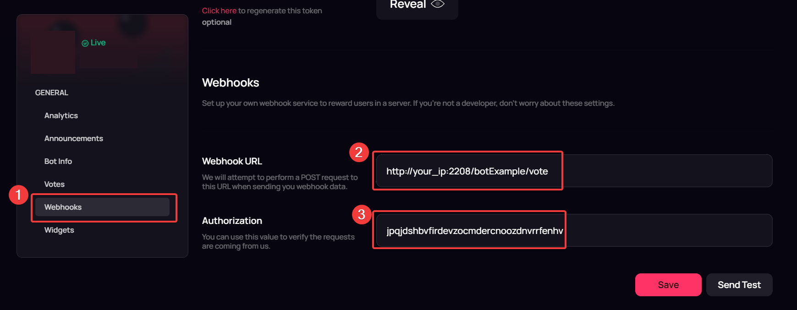

# topgg-discord-notification
Send a notification on Discord when someone vote on Top.gg

How to use it ?
1. Clone the repository 
2. Install the packages
3. Fill the config.json file
   - API configuration
   - Discord configuration (webhook & bot token use to retrieve some information)
   - IPs whitelist to secure the API
   - top.gg configuration (Authorization)
4. Fill the Webhook URL and the Authorization on top.gg

5. Start the main.js file
6. Enjoy

```bash
git clone
npm install
node main.js
```
- In order to secure the API, an ip whitelist is available. You can add your ip in the config.json file.
- For each bot / guild you want to setup, use a unique top.gg token.
- On top.gg you can use the send test button to check if the webhook is working.

### Links
[Discord server](https://discord.gg/Dwn5Nc6WgR) : If you have any questions, don't hesitate to join the discord server.

[BotMarket Website](https://botmarket.ovh) : Our website where you can find all our bots.
